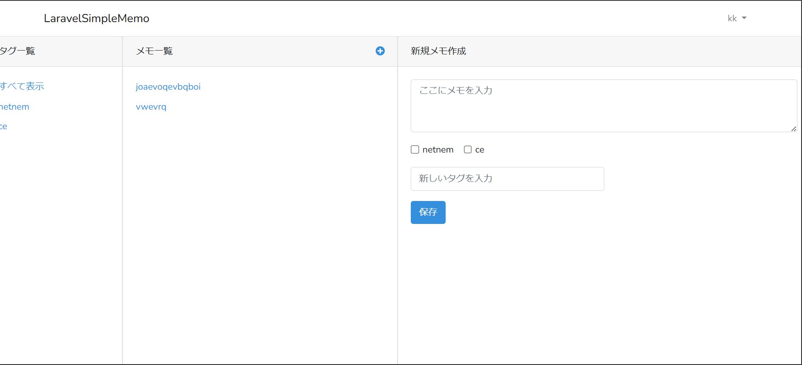

# ECS Terraform

このリポジトリは、AWS ECS（Elastic Container Service）環境をTerraformを使用して構築するための設定を提供する。  
以下の手順に従って、Windows 11上のWSL2環境でのセットアップ方法を説明する。

## 前提条件

- **実行環境**: Windows 11上のWSL2 + Docker Desktop
- **TerraformのDockerイメージの管理**: [本ファイル](./profile.d/terraform.sh)を参照。
- **変数管理**: `terraform.tfvars`ファイルで変数の値を管理

## セットアップ手順

1. **WSL2のインストールと設定**

   - [WSL2のインストール手順](https://docs.microsoft.com/ja-jp/windows/wsl/install)に従い、WSL2をインストールする。

1. **Docker Desktopのインストールと設定**

   - [Docker Desktopのインストール手順](https://docs.docker.com/desktop/install/windows-install/)に従い、Docker Desktopをインストールする。

1. **本リポジトリを git clone する（詳細手順省略）**

1. **terraform 及び aws コマンド使えるようにする**

   - 以下コマンドで、スクリプトを読み込む。
     ```bash
     source ./profile.d/terraform.sh
     ```
   - 構築時点でのバージョンのため、必要であれば Docker image 内の terraform 及び aws のバージョンアップを実施する。（任意）

1. **AWS IAMユーザーの作成と権限付与**

   - `terraform-exec`というIAMユーザーを作成し、必要な権限を付与する。（詳細手順省略）
   - `terraform-exec`のアクセスキーとシークレットアクセスキーを、`terraform-exec`プロファイルに登録する。（詳細手順省略）

1. **変数ファイル（`terraform.tfvars`）の作成**

   - プロジェクトルートディレクトリに`terraform.tfvars`ファイルを作成し、必要な変数の値を設定する。例:

     ```hcl
     db_password = "<DBユーザーのパスワード>"
     domain      = "<ドメイン名>"
     ```

1. **Terraformの初期化**

   - プロジェクトディレクトリにおいて、以下のコマンドを実行してTerraformを初期化する。

     ```bash
     AWS_PROFILE=terraform-exec terraform init
     ```

1. **ECR関連のみ適用**

   - `ecr.tf`/`iam.tf`/`provider.tf`/`variables.tf`以外のtfファイルをコメントアウトする。

   - 以下のコマンドでplanを確認する。

     ```bash
     AWS_PROFILE=terraform-exec terraform plan
     ```

   - 以下のコマンドでリソースを適用する。

     ```bash
     AWS_PROFILE=terraform-exec terraform apply
     ```

1. **Laravel image の Push**

   - [本リポジトリ](https://github.com/uchidayuma/udemy-laravel8-mysql-simple-memo)の.envファイルに`DB_PASSWORD`を定義して、imageをbuild及びpush（詳細手順は省略）

1. **他リソースを適用**

   - コメントアウトしたtfファイルを元に戻す。

   - 以下のコマンドでplanを確認する。

     ```bash
     AWS_PROFILE=terraform-exec terraform plan
     ```

   - 以下のコマンドでリソースを適用する。

     ```bash
     AWS_PROFILE=terraform-exec terraform apply
     ```

1. **以下リンクへ飛ぶ**

   - <https://memotest.click>

   - ユーザー登録後、以下画面になればよい


## 学習教材

このリポジトリの設定は、以下の教材で作成したリソースを基にしている。

- [Udemy](https://www.udemy.com/course/ecsfargate/?couponCode=KEEPLEARNING)

## 構成図

[構成図](./docs/ecs.png)
